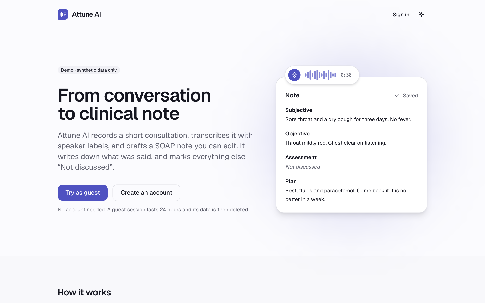
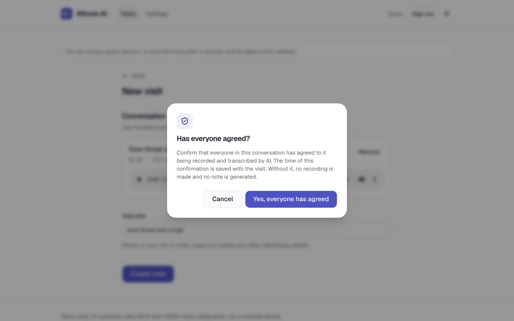
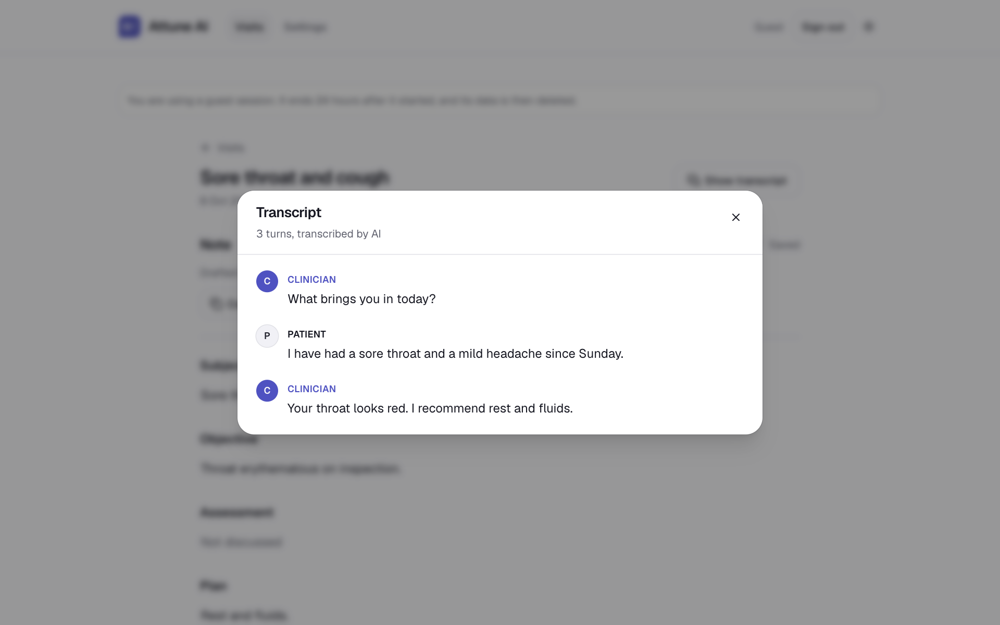
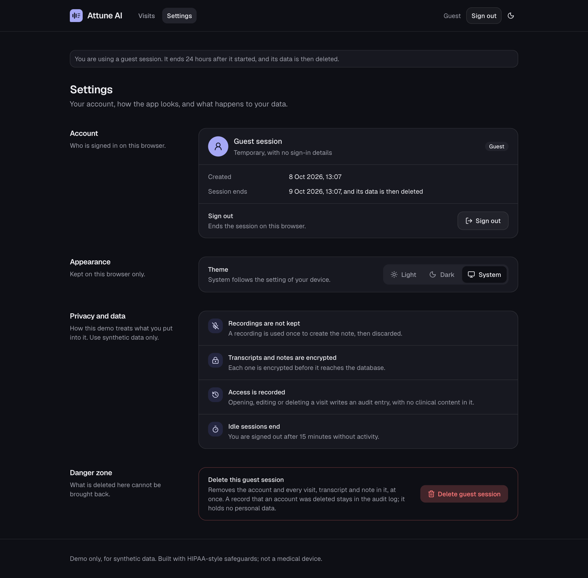
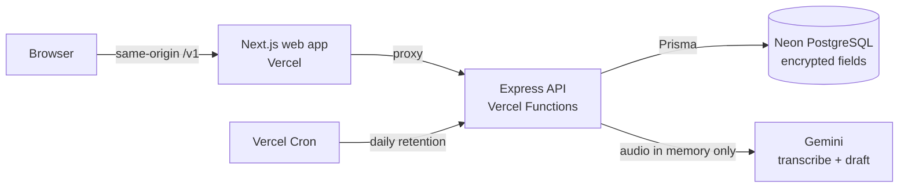

<p align="center">
  
</p>

<h1 align="center">Attune AI</h1>

<p align="center">
  <strong>An AI clinical scribe: record a consultation, get a speaker-labelled transcript and an editable SOAP note in seconds.</strong>
</p>

<p align="center">
  <a href="https://github.com/wassii-khan-git/attune-ai/actions/workflows/ci.yml"></a>
  <a href="https://github.com/wassii-khan-git/attune-ai/actions/workflows/codeql.yml"></a>
</p>

<p align="center">
  <a href="https://attune-ai-web.vercel.app"><strong>Try the live demo</strong></a> ·
  <a href="https://attune-ai-api.vercel.app/docs"><strong>API docs</strong></a> ·
  <a href="docs/adr">Architecture decisions</a> ·
  <a href="docs/threat-model.md">Threat model</a>
</p>

> Click **Try as guest**, open **New visit**, pick a **Sample** consultation and press **Create note**. No sign-up or microphone needed.


> **Demo only.** Built with HIPAA-style safeguards, but not HIPAA compliant and not a medical device. Use synthetic data only; never real patient information.

## What it does

1. **Record or upload.** Record up to five minutes in the browser with a live timer and waveform, upload an audio file, or use one of two built-in sample consultations.
2. **Ask for consent.** Before the microphone starts or anything is sent, a dialog asks whether everyone in the conversation has agreed. The answer is timestamped, and the API refuses to process a visit without it.
3. **Transcribe.** The conversation is transcribed with Clinician and Patient labels.
4. **Draft the note.** A structured SOAP note streams in section by section. Anything not discussed is marked _Not discussed_ instead of being invented.
5. **Review and export.** The note reads as a plain document: select any section to edit it, and it saves by itself. Open the transcript in a dialog to check the note against it, copy the note as text, or export it as a PDF.
6. **Stay in control.** Search past visits by title, and delete a single visit or the whole account at any time.

|                       Landing page                        |             Consent, asked before anything is recorded or sent             |
| :-------------------------------------------------------: | :------------------------------------------------------------------------: |
|          |                         |
|            **The transcript, one click away**             |                      **Settings, in the dark theme**                       |
|  |  |

All screenshots show invented consultations.

## Architecture



A pnpm and Turborepo monorepo. `packages/shared` holds the Zod schemas that the API and web app both use, so a change to the note's shape is checked everywhere at compile time.

```
apps/api          Express 5 + TypeScript: routes → controllers → services → repositories
apps/api/eval     Synthetic transcripts that score the note prompt
apps/web          Next.js App Router, Tailwind CSS, shadcn/ui
apps/web/e2e      Playwright test of the guest flow
packages/shared   Zod schemas and types shared by every app
docs/adr          Architecture decision records
docs/threat-model.md
```

## Engineering highlights

- **Streaming over a job queue.** The note streams back in a single request (NDJSON), so users see output immediately with no worker infrastructure. ([ADR 0003](docs/adr/0003-streaming-instead-of-a-job-queue.md))
- **Sessions done properly.** 15-minute access tokens, rotating refresh tokens stored hashed, replay detection that revokes every session, `httpOnly` cookies for the browser. ([ADR 0004](docs/adr/0004-sessions-and-tokens.md))
- **Same-origin proxy.** The web app reaches the API through its own origin, so `SameSite` cookies keep working across two Vercel projects without weakening them, behind a nonce-based content security policy. ([ADR 0007](docs/adr/0007-same-origin-proxy-for-the-web-app.md))
- **Serverless-aware design.** Rate limits and AI quotas are stored in Postgres, because serverless functions share no memory. ([ADR 0006](docs/adr/0006-rate-limits-and-quotas-in-postgres.md))
- **Resilient AI calls.** Timeouts, one retry with backoff, versioned prompts, and an evaluation set (`pnpm eval`) that checks notes for required facts and invented claims.
- **An edit is never lost.** The note saves as it is typed, one save at a time and always the newest text; a failed save keeps the text and retries. ([ADR 0009](docs/adr/0009-editing-saving-and-exporting-the-note.md))
- **Fail-fast configuration.** The API validates every environment variable at startup and refuses to run with unsafe production settings.
- **A documented contract.** The API is versioned under `/v1`, and its OpenAPI document is generated from the same Zod schemas that validate requests.

## HIPAA-style safeguards

| Safeguard                 | How                                                                                                                                         |
| ------------------------- | ------------------------------------------------------------------------------------------------------------------------------------------- |
| Encryption at rest        | Transcripts and notes encrypted per field with AES-256-GCM ([ADR 0005](docs/adr/0005-field-level-encryption.md))                            |
| No audio storage          | Audio is held in memory, sent to the model, then discarded                                                                                  |
| Audit trail               | Who viewed, changed or deleted what, and when, with no clinical content in audit rows                                                       |
| Consent                   | Asked in a dialog before recording or upload, timestamped per visit; processing is blocked without it                                       |
| Minimum necessary         | Lists never decrypt; only the visit detail view does. On screen, the transcript stays closed until it is asked for                          |
| No sensitive data in logs | Redacting logger; library error messages withheld                                                                                           |
| Session limits            | 15-minute idle sign-out on the web                                                                                                          |
| Retention                 | A guest session ends after 24 hours, and a daily job then deletes the account and its visits; users can delete a visit or the whole account |
| Access control            | Ownership checked in every query; another user's visit answers 404                                                                          |

The [threat model](docs/threat-model.md) lists the threats, the mitigations, the **known limits of this demo**, and what real patient data would additionally require.

## Quality

- **Tests:** 558 unit and API tests (298 API, 260 web), integration tests against a real PostgreSQL in CI, and a Playwright browser test of the whole guest flow. 80% coverage threshold on API services.
- **CI on every push:** formatting, lint, typecheck, tests, production build, dependency audit, CodeQL scanning and Dependabot.
- **Accessibility:** Lighthouse scores 100 for accessibility and 100 for best practices on the landing page, the visit list, the new-visit page and the visit page (mobile preset, production build, measured locally); performance is 90 to 96. Text contrast is at least 4.5:1 in both themes, at rest and on hover, computed from the design tokens.
- **Architecture decisions:** [ten ADRs](docs/adr) record the context, decision, alternatives and trade-offs behind each significant choice.

## Tech stack

- **Frontend:** Next.js 16, React 19, TypeScript 6, Tailwind CSS 4, shadcn/ui on Base UI
- **Backend:** Node.js 24, Express 5, Zod 4, Prisma 7, PostgreSQL (Neon)
- **AI:** Google Gemini via the Vercel AI SDK 7
- **Infrastructure:** Vercel (two projects + Cron), GitHub Actions, pnpm workspaces, Turborepo
- **Testing:** Vitest, Supertest, Playwright

## Demo limits

|                       | Guest           | Account         |
| --------------------- | --------------- | --------------- |
| Notes created per day | 3               | 10              |
| Visits kept           | 20              | 200             |
| Lifetime              | 24 hours        | Until deleted   |
| Recording             | 5 minutes, 4 MB | 5 minutes, 4 MB |

A shared daily budget also caps note creation across all users, to protect the model's free quota.

## Run locally

Requires Node.js 24, pnpm, a PostgreSQL database and a Gemini API key.

```bash
git clone https://github.com/wassii-khan-git/attune-ai.git
cd attune-ai
pnpm install
cp apps/api/.env.example apps/api/.env         # fill in the values described in the file
cp apps/web/.env.example apps/web/.env.local   # the default points at the local API
pnpm --filter @attune/api db:migrate
pnpm dev                                       # API on port 4000, web app on port 3000
```

| Command                 | Purpose                                                                        |
| ----------------------- | ------------------------------------------------------------------------------ |
| `pnpm dev`              | Run the API and web app                                                        |
| `pnpm test`             | Unit and API tests                                                             |
| `pnpm test:integration` | Tests against a real PostgreSQL                                                |
| `pnpm test:e2e`         | Browser test of the guest flow, on an in-memory API: no database or key needed |
| `pnpm eval`             | Score the note prompt against synthetic consultations                          |
| `pnpm lint`             | ESLint, including the rules that enforce the API's layers                      |

## Status

The API and the web app are complete and live. A mobile app (Expo) on the same API and shared schemas is next.

## Author

**Waseem Khan**, Software Engineer (Full Stack) · [LinkedIn](https://www.linkedin.com/in/waseem-khan-5a9393214) · [GitHub](https://github.com/wassii-khan-git)
