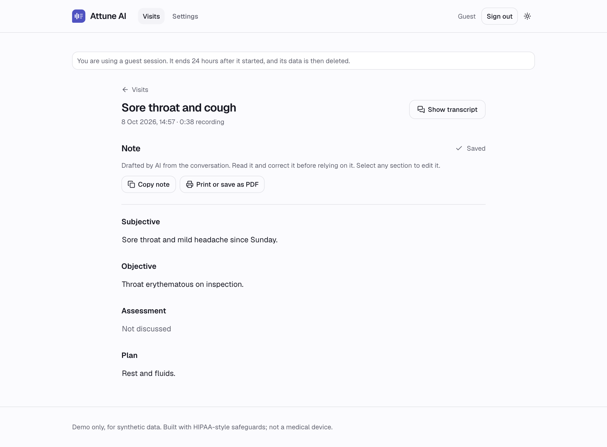
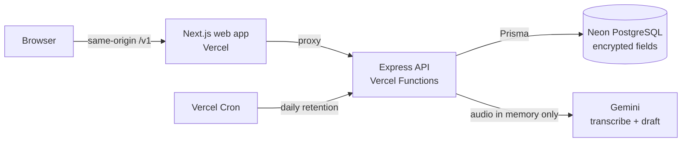

# Attune AI

**An AI clinical scribe: record a consultation, get a speaker-labelled transcript and an editable SOAP note in seconds.**

[](https://github.com/wassii-khan-git/attune-ai/actions/workflows/ci.yml)
[](https://github.com/wassii-khan-git/attune-ai/actions/workflows/codeql.yml)

**[Try the live demo](WEB_URL)** · **[API docs](https://attune-ai-api.vercel.app/docs)** · [Architecture decisions](docs/adr) · [Threat model](docs/threat-model.md)

> Click **Try as guest**, then **Use a sample consultation**. No sign-up or microphone needed.



> **Demo only.** Built with HIPAA-style safeguards, but not HIPAA compliant and not a medical device. Use synthetic data only; never real patient information.

## What it does

1. **Consent first.** A visit cannot be processed until consent is recorded and timestamped.
2. **Record or upload.** Record in the browser with a live timer and waveform, upload an audio file, or use a built-in sample consultation.
3. **Transcribe.** The conversation is transcribed with Clinician and Patient labels.
4. **Draft the note.** A structured SOAP note streams in section by section. Anything not discussed is marked *Not discussed* instead of being invented.
5. **Review and export.** Edit each section with autosave, copy it, or export it as a PDF.

## Architecture



A pnpm and Turborepo monorepo. `packages/shared` holds the Zod schemas that the API and web app both use, so a change to the note's shape is checked everywhere at compile time.

```
apps/api         Express 5 + TypeScript: routes → controllers → services → repositories
apps/web         Next.js App Router, Tailwind CSS, shadcn/ui
packages/shared  Zod schemas and types shared by every app
docs/adr         Architecture decision records
```

## Engineering highlights

- **Streaming over a job queue.** The note streams back in a single request (NDJSON), so users see output immediately with no worker infrastructure. ([ADR 0003](docs/adr/0003-streaming-instead-of-a-job-queue.md))
- **Sessions done properly.** 15-minute access tokens, rotating refresh tokens stored hashed, replay detection that revokes every session, `httpOnly` cookies for the browser. ([ADR 0004](docs/adr/0004-sessions-and-tokens.md))
- **Same-origin proxy.** The web app reaches the API through its own origin, so `SameSite` cookies keep working across two Vercel projects without weakening them. ([ADR 0007](docs/adr/0007-same-origin-proxy-for-the-web-app.md))
- **Serverless-aware design.** Rate limits and AI quotas are stored in Postgres, because serverless functions share no memory. ([ADR 0006](docs/adr/0006-rate-limits-and-quotas-in-postgres.md))
- **Resilient AI calls.** Timeouts, one retry with backoff, versioned prompts, and an evaluation set (`pnpm eval`) that checks notes for required facts and invented claims.
- **Fail-fast configuration.** The API validates every environment variable at startup and refuses to run with unsafe production settings.

## HIPAA-style safeguards

| Safeguard | How |
|---|---|
| Encryption at rest | Transcripts and notes encrypted per field with AES-256-GCM ([ADR 0005](docs/adr/0005-field-level-encryption.md)) |
| No audio storage | Audio is held in memory, sent to the model, then discarded |
| Audit trail | Who viewed, changed or deleted what, and when, with no clinical content in audit rows |
| Consent | Recorded and timestamped per visit; processing is blocked without it |
| Minimum necessary | Lists never decrypt; only the visit detail view does |
| No sensitive data in logs | Redacting logger; library error messages withheld |
| Session limits | 15-minute idle sign-out on the web |
| Retention | Guest data purged by a daily scheduled job; users can delete visits or their whole account |
| Access control | Ownership checked in every query; another user's visit answers 404 |

The [threat model](docs/threat-model.md) lists the threats, the mitigations, the **known limits of this demo**, and what real patient data would additionally require.

## Quality

- **Tests:** unit and API tests, integration tests against a real PostgreSQL in CI, and a Playwright browser test of the guest flow. 80% coverage threshold on API services.
- **CI on every push:** formatting, lint, typecheck, tests, production build, dependency audit, CodeQL scanning and Dependabot.
- **Architecture decisions:** [ten ADRs](docs/adr) record the context, decision, alternatives and trade-offs behind each significant choice.

## Tech stack

**Frontend:** Next.js, React 19, TypeScript, Tailwind CSS, shadcn/ui
**Backend:** Node.js, Express 5, Zod, Prisma, PostgreSQL (Neon)
**AI:** Google Gemini via the Vercel AI SDK
**Infrastructure:** Vercel (two projects + Cron), GitHub Actions, pnpm workspaces, Turborepo
**Testing:** Vitest, Supertest, Playwright

## Run locally

Requires Node.js 24, pnpm, a PostgreSQL database and a Gemini API key.

```bash
git clone https://github.com/wassii-khan-git/attune-ai.git
cd attune-ai
pnpm install
cp apps/api/.env.example apps/api/.env   # fill in the values described in the file
pnpm --filter @attune/api db:migrate
pnpm dev
```

| Command | Purpose |
|---|---|
| `pnpm dev` | Run the API and web app |
| `pnpm test` | Unit and API tests |
| `pnpm test:integration` | Tests against a real PostgreSQL |
| `pnpm test:e2e` | Browser test of the guest flow |
| `pnpm eval` | Score the note prompt against synthetic consultations |

## Author

**Waseem Khan**, Software Engineer (Full Stack) · [LinkedIn](https://www.linkedin.com/in/waseem-khan-5a9393214) · [GitHub](https://github.com/wassii-khan-git)
